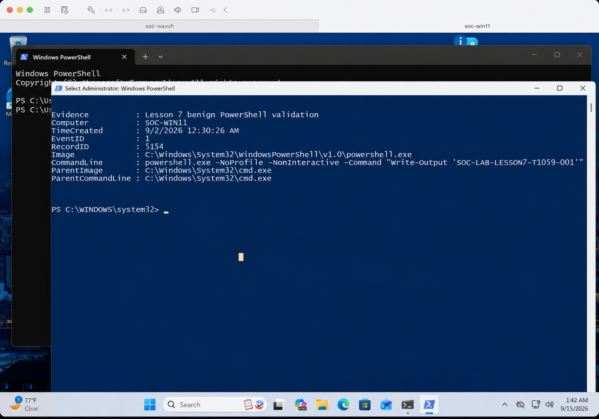

# Mini SOC Lab

A portfolio-focused Security Operations Center laboratory for developing
practical experience in:

- Security monitoring
- Windows and Linux telemetry
- Wazuh SIEM administration
- Sysmon
- Detection engineering
- Sigma rules
- MITRE ATT&CK
- Incident investigation
- Python security automation
- Technical reporting

## Project Status

**Current phase:** Lesson 10 controlled attack simulation is complete. A safe,
reversible Registry Run key modification on `SOC-WIN11` produced Sysmon Event
ID `13` and a native Wazuh rule `92302` alert mapped to `T1547.001`. Cleanup
checks confirmed that the Registry value was removed and its stored marker
command never created a file.

## Lab Architecture

The laboratory uses VMware Fusion 26 on an Apple Silicon host. All guest
systems use ARM64 operating-system images.

| System | Operating system | vCPU | RAM | Disk | Lab IP |
|---|---|---:|---:|---:|---|
| Wazuh server | Ubuntu Server 24.04 LTS ARM64 | 4 | 8 GB | 60 GB | `192.168.132.10` |
| Windows endpoint | Windows 11 ARM64 | 4 | 5 GB | 64 GB | `192.168.132.20` |
| Linux endpoint | Ubuntu 24.04 LTS ARM64 | 2 | 3 GB | 40 GB | `192.168.132.30` |

The Wazuh server uses an all-in-one deployment containing the manager, indexer,
and dashboard. It is reachable from the Mac host at
`https://192.168.132.10` on the private lab network.

## Network Isolation

- VMware `vmnet1` provides the private host-only lab network at
  `192.168.132.0/24`.
- Static lab addresses are outside VMware's DHCP pool.
- NAT is used temporarily for trusted updates and package installation.
- Bridged networking is not used.
- NAT can be disconnected during controlled simulations that do not require
  internet access.

## Project Objectives

- Collect Windows and Linux security telemetry
- Generate controlled security activity
- Write and validate custom detections
- Map detections to MITRE ATT&CK
- Investigate resulting alerts
- Produce professional incident reports
- Automate parts of the investigation workflow with Python

## Planned Deliverables

- [x] Project directory structure
- [x] Initial objectives
- [x] Safety boundaries
- [x] Initial data-flow documentation
- [x] Virtual laboratory architecture
- [x] Wazuh server deployment
- [x] Windows endpoint deployment
- [x] Linux endpoint deployment
- [x] Sysmon configuration
- [x] Reusable alert-triage worksheet and two worked cases
- [x] Evidence-based MITRE ATT&CK coverage matrix and validation evidence
- [x] Custom Wazuh rules
- [x] Portable Sigma detection rule with repeatable fixture tests
- [x] Controlled attack simulation
- [ ] Python alert-processing utility
- [ ] Three incident reports
- [ ] Final demonstration video

## Architecture Documentation

- [Data flow](architecture/data-flow.md)
- [Network plan](architecture/network-plan.md)
- [Resource plan](architecture/resource-plan.md)
- [Snapshot plan](architecture/snapshot-plan.md)
- [Host specifications](docs/host-specifications.md)
- [Wazuh server deployment](docs/wazuh-server-deployment.md)
- [Windows endpoint deployment and validation](docs/windows-endpoint-deployment.md)
- [Linux endpoint deployment and validation](docs/linux-endpoint-deployment.md)
- [Alert triage worksheet](incident-reports/lesson-06-alert-triage-worksheet.md)
- [MITRE ATT&CK coverage matrix](docs/mitre-attack-coverage.md)
- [Custom Wazuh rule development and validation](docs/custom-wazuh-rule-development.md)
- [Sigma detection engineering and validation](docs/sigma-detection-engineering.md)
- [Controlled Registry Run key simulation](simulations/lesson-10-registry-run-key-simulation.md)
- [Safety boundaries](docs/safety-boundaries.md)

## Current Milestone

The `soc-wazuh` ARM64 server is operational. Windows endpoint `SOC-WIN11`
(`001`) forwards Sysmon telemetry, and Ubuntu endpoint `SOC-UBUNTU` (`002`)
forwards Linux system and authentication telemetry. Controlled, benign tests
were visible in Wazuh Threat Hunting for both endpoints.


Powered-off `03-wazuh-agent-installed` snapshots preserve both validated
endpoint states. The Linux rule `5710` alert has now been investigated using a
repeatable triage workflow and classified as a high-confidence benign true
positive. The same workflow has now been applied to the Windows Sysmon marker
alert, including parent-child process correlation and surrounding-event
review. The completed worksheet preserves both investigations and their
supporting evidence. Lesson 7 now applies an evidence-based ATT&CK coverage
matrix to those findings. A standalone benign PowerShell marker was recorded
locally in Sysmon Event ID 1, but it did not produce a visible Wazuh alert.
During that review, a separate Wazuh-agent PowerShell process deleting
temporary `secpol.cfg` was observed triggering Wazuh rule `92021`, level `3`,
mapped by Wazuh to `T1070.004` File Deletion.

Together, these observations demonstrate an important detection-engineering
distinction: collecting endpoint activity does not guarantee that an alerting
rule covers it. Lesson 8 addresses that verified gap with custom Wazuh rule
`100100`, which matches a deliberately unique PowerShell validation marker and
maps the resulting alert to `T1059.001`. The expected-match test produced a
live level `5` alert from `SOC-WIN11`. A separate PowerShell control event was
recorded by local Sysmon but produced no rule `100100` alert in the bounded
Wazuh search window.

Lesson 9 expresses that same bounded detection in portable Sigma YAML. Sigma
CLI validation returned zero errors or issues. The rule was translated into
OpenSearch Lucene syntax through an ECS Windows field-mapping pipeline, then
compiled through the SQLite backend and evaluated against sanitized positive
and negative JSON fixtures. The expected marker matched and the control marker
did not. The documentation distinguishes portable conversion from native Wazuh
deployment and records the required field-mapping limitations.

Lesson 10 applies the same evidence-first approach to a controlled persistence
simulation. A temporary current-user Registry Run value generated Sysmon Event
ID `13`; native Wazuh rule `92302`, level `6`, alerted and mapped the behavior
to `T1547.001`. The value was removed after validation, and a separate
filesystem check confirmed that its stored marker command never executed.

Sanitized Sysmon evidence for the Lesson 7 marker is retained below. Separate
PDF exports preserve the unrelated rule `92021` observation and the Lesson 8
rule `100100` positive-match result.



[View the separate Wazuh rule `92021` event export](docs/evidence/lesson-07-wazuh-rule-92021-t1070-004.pdf)

[View the Lesson 8 rule `100100` positive-match export](docs/evidence/lesson-08-wazuh-rule-100100-t1059-001-positive-match.pdf)

[View the Lesson 8 negative-control result](screenshots/lesson-08-wazuh-rule-100100-negative-control-no-alert.png)

[View the Lesson 10 Registry Run key simulation report](simulations/lesson-10-registry-run-key-simulation.md)

[View the Lesson 10 Wazuh rule `92302` alert export](docs/evidence/lesson-10-wazuh-rule-92302-t1547-001-registry-run-alert.pdf)

## Repository Structure

```text
mini-soc-lab/
├── architecture/
├── automation/
├── detections/
│   ├── sigma/
│   └── wazuh/
├── docs/
│   └── evidence/
├── incident-reports/
├── sample-data/
├── screenshots/
├── simulations/
├── tests/
├── .gitignore
└── README.md
```
