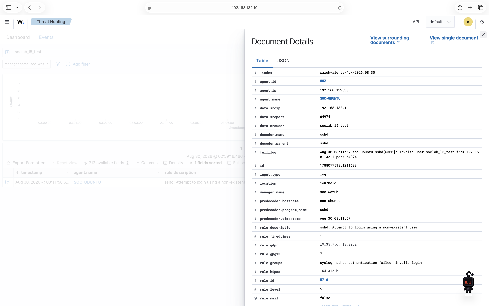

# Linux Endpoint and Wazuh Agent Deployment

## Outcome

An Ubuntu Server 24.04.4 LTS ARM64 endpoint was deployed as `soc-ubuntu`,
connected to the private SOC network, and enrolled with the Wazuh manager as
agent `SOC-UBUNTU`. A controlled authentication failure was decoded from the
Ubuntu journal and displayed as a Wazuh alert, validating the complete Linux
endpoint-to-dashboard telemetry path.

## Endpoint Platform

| Item | Implemented configuration |
|---|---|
| Hypervisor | VMware Fusion 26.0.0 |
| Guest operating system | Ubuntu Server 24.04.4 LTS ARM64 |
| Hostname | `soc-ubuntu` |
| vCPU | 2 |
| RAM | 3 GB (3072 MB) |
| Virtual disk | 40 GB dynamically allocated |
| Root filesystem | 36 GB usable; 28 GB available at baseline validation |
| Remote administration | OpenSSH with dedicated Ed25519 key authentication |

The original 2 GB memory plan was raised to 3 GB after VMware warned that the
lower allocation was insufficient for the selected guest configuration.
Required Ubuntu updates were applied before Wazuh enrollment.

## Network Implementation

| Interface | VMware network | Configuration | Purpose |
|---|---|---|---|
| `enp2s0` | NAT | DHCP; validated as `172.16.87.137/24` | Trusted updates and package downloads |
| `enp10s0` | `vmnet1` host-only | Static `192.168.132.30/24` | Wazuh traffic and Mac administration |

Only `enp2s0` supplies a default route through VMware NAT. The private
interface has no gateway or DNS configuration, preventing it from replacing
the intended outbound path. Bridged networking is not used.

Before agent installation, the endpoint successfully reached Wazuh server
`192.168.132.10` using ICMP, agent traffic port 1514/TCP, enrollment port
1515/TCP, and dashboard port 443/TCP.

## SSH Administration

The Ubuntu `ssh` service is active and enabled. The Mac uses alias
`soc-ubuntu`, private address `192.168.132.30`, user `cvalle`, and dedicated key
`~/.ssh/soc_ubuntu_ed25519`. Non-interactive key authentication was validated
after enrollment of the public key.

The private key and Ubuntu `authorized_keys` content are intentionally excluded
from this repository. Key authentication replaces the account password for SSH
login; the Ubuntu password remains required for privilege elevation with
`sudo`.

## Wazuh Agent Integration

Wazuh agent `4.14.7-1` for ARM64 was installed from the official signed Wazuh
APT repository to match the central manager version.

| Setting | Value |
|---|---|
| Manager | `192.168.132.10` |
| Registration server | `192.168.132.10` |
| Agent name | `SOC-UBUNTU` |
| Assigned agent ID | `002` |
| Agent package | `wazuh-agent 4.14.7-1` |
| Architecture | `arm64` / `aarch64` |

The service is active and enabled. The package was placed on hold to prevent a
general operating-system update from moving the agent ahead of the manager
version without an explicit compatibility review.

Official references:

- [Deploying Wazuh agents on Linux endpoints](https://documentation.wazuh.com/current/installation-guide/wazuh-agent/wazuh-agent-package-linux.html)
- [Wazuh package list](https://documentation.wazuh.com/current/installation-guide/packages-list.html)

## End-to-End Authentication Validation

From the Mac, the test attempted one SSH connection using deliberately
nonexistent account `soclab_l5_test`. Public-key and password authentication
were disabled for that command, ensuring that it produced a single controlled
rejection without guessing a password or changing the endpoint.

```bash
ssh \
  -o PreferredAuthentications=none \
  -o PubkeyAuthentication=no \
  -o PasswordAuthentication=no \
  soclab_l5_test@192.168.132.30 true
```

The resulting Wazuh document verified:

| Field | Observed value |
|---|---|
| Agent | `SOC-UBUNTU` (`002`) |
| Agent address | `192.168.132.30` |
| Source address | `192.168.132.1` (Mac/VMware host) |
| Source user | `soclab_l5_test` |
| Decoder | `sshd` |
| Input location | `journald` |
| Rule ID | `5710` |
| Rule level | `5` |
| Description | `sshd: Attempt to login using a non-existent user` |
| Rule groups | `syslog`, `sshd`, `authentication_failed`, `invalid_login` |



This proves more than agent availability. The endpoint generated security
activity, Ubuntu recorded it, the Wazuh agent collected it, the manager decoded
and matched it to a rule, and the indexed alert was available for investigation
in Threat Hunting.

The reusable Mac-side test is
[`tests/validate-linux-ssh-telemetry.sh`](../tests/validate-linux-ssh-telemetry.sh).
It accepts an optional target IP and test username, verifies that the controlled
login is rejected, and directs the operator to confirm the corresponding Wazuh
event. It does not create accounts, modify files, or attempt a real password.

## Recovery Checkpoints

- `01-clean-ubuntu`: Fresh Ubuntu installation with static networking and
  key-based SSH validated.
- `02-updated`: Current Ubuntu updates with post-reboot identity, routing, SSH,
  DNS, and outbound HTTPS validated.
- `03-wazuh-agent-installed`: Active agent with the controlled SSH
  authentication alert validated in Wazuh.

Snapshots support rollback but are not backups.

## Skills Demonstrated

- Ubuntu Server ARM64 deployment and resource adjustment
- Segmented NAT and host-only Linux networking with Netplan
- Static addressing without an unintended private-network gateway
- OpenSSH service administration and Ed25519 key authentication
- Signed APT repository and version-matched package installation
- Wazuh Linux agent enrollment and lifecycle management
- Journald and `sshd` authentication-event interpretation
- Controlled security validation and evidence preservation
