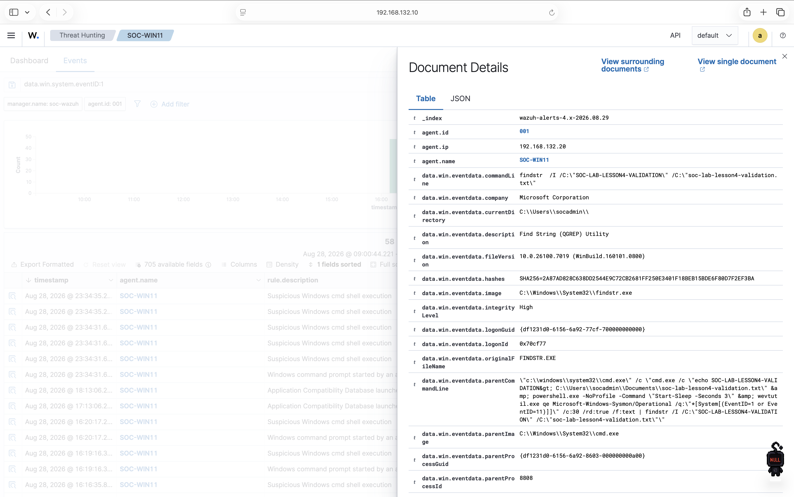

# Windows Endpoint, Sysmon, and Wazuh Agent Deployment

## Outcome

A Windows 11 ARM64 endpoint was deployed as `SOC-WIN11`, connected to the
private SOC network, instrumented with Sysmon, and enrolled with the Wazuh
manager. A benign validation action was observed locally by Sysmon and then in
Wazuh Threat Hunting, confirming the endpoint-to-dashboard telemetry path.

## Endpoint Platform

| Item | Implemented configuration |
|---|---|
| Hypervisor | VMware Fusion 26.0.0 |
| Guest operating system | Windows 11 Pro ARM64, build 26200 |
| Computer name | `SOC-WIN11` |
| Administrative user | `socadmin` |
| vCPU | 4 |
| RAM | 5 GB (5120 MB) |
| Virtual disk | 64 GB dynamically allocated |
| Firmware security | UEFI Secure Boot and virtual TPM |
| Remote administration | OpenSSH, restricted to the lab environment |

VMware Tools and required Windows updates were installed. An optional preview
update was intentionally skipped to keep the lab on a stable baseline.

## Network Implementation

The endpoint uses two adapters with distinct responsibilities:

| Windows interface | VMware network | Address | Purpose |
|---|---|---|---|
| `Ethernet` | NAT | DHCP; validated as `172.16.87.135/24` | Trusted updates and downloads |
| `Ethernet 2` | `vmnet1` host-only | Static `192.168.132.20/24` | Wazuh traffic and Mac administration |

Only the NAT adapter supplies a default route. The host-only adapter has no
gateway, and bridged networking is not used. TCP connectivity from Windows to
the Wazuh server at `192.168.132.10` was verified on dashboard port 443 and
agent-enrollment port 1515.

## Sysmon Deployment

Microsoft Sysmon 15.21 was downloaded from the official Sysinternals source.
The ARM64 executable, `Sysmon64a.exe`, had a valid Microsoft Authenticode
signature before installation.

The version-controlled baseline is
[`configs/sysmon/sysmonconfig.xml`](../configs/sysmon/sysmonconfig.xml). It
collects:

- Process creation (Event ID 1)
- Network connections (Event ID 3)
- File creation in selected investigative paths (Event ID 11)
- Run and RunOnce registry persistence activity (Event IDs 12–14)
- DNS queries (Event ID 22)

The baseline deliberately avoids enabling every available event type. It is a
learning-lab configuration intended to balance visibility with event volume,
not a production policy.

The `Sysmon64a` service was verified as Running with Automatic startup, its
driver was active, and the Sysmon Operational event channel contained process
and file-creation telemetry. Snapshot `02-sysmon-installed` preserves this
known-good state.

## Wazuh Agent Integration

Wazuh agent `4.14.7-1` was downloaded from the official Wazuh package source.
Its Microsoft installer signature was valid and its SHA-256 digest was:

```text
E967F36B75589D6210244FD58239C7021FA53A77C38D92315C3B3BD115002EDE
```

The agent was enrolled with these non-secret values:

| Setting | Value |
|---|---|
| Manager | `192.168.132.10` |
| Registration server | `192.168.132.10` |
| Agent name | `SOC-WIN11` |
| Assigned agent ID | `001` |

The live agent configuration remains at
`C:\Program Files (x86)\ossec-agent\ossec.conf` inside the VM. The repository
script
[`automation/configure-windows-sysmon-collection.ps1`](../automation/configure-windows-sysmon-collection.ps1)
creates a one-time backup and idempotently adds the Sysmon Operational channel
as an `eventchannel` source. The `WazuhSvc` service was verified as Running with
Automatic startup. Agent logs confirmed encrypted communication, Sysmon
channel analysis, TCP connection to manager port 1514, and online status.

Authentication material in the agent's `client.keys` file is intentionally not
included in this repository.

## End-to-End Validation

The benign test created:

```text
C:\Users\socadmin\Documents\soc-lab-lesson4-validation.txt
```

with the marker:

```text
SOC-LAB-LESSON4-VALIDATION
```

Windows `findstr.exe` then read the marker. Sysmon recorded the resulting
process activity, the Wazuh agent forwarded it, and Wazuh generated a
"Suspicious Windows cmd shell execution" alert visible in Threat Hunting.



The expanded event identifies:

- Agent `SOC-WIN11` (`001`) at `192.168.132.20`
- `findstr.exe` as the observed process
- `cmd.exe` as its parent process
- The unique validation marker and marker-file name in the command line
- Process integrity level and executable SHA-256 telemetry

An earlier expanded Event ID 11 also showed file creation from the Sysmon
Operational channel. Its target was a temporary PowerShell policy-test `.ps1`
file rather than the marker file, so it remains supporting evidence instead of
the primary portfolio screenshot.

### Why the text file is not committed

The marker file is a disposable object inside the Windows VM. By itself it
does not prove that telemetry was collected or analyzed. The professional,
repeatable evidence is the procedure, configuration, automation, observed
event, and screenshot preserved in this repository.

The reusable test is
[`tests/validate-sysmon-telemetry.ps1`](../tests/validate-sysmon-telemetry.ps1).
It creates the harmless marker, invokes `findstr.exe`, waits for a matching
local Sysmon Event ID 1 or 11, and tells the operator to confirm the marker in
Wazuh. Passing `-Cleanup` removes the marker file after the test. It does not
install software, modify Wazuh configuration, or perform malicious activity.

Run it from an interactive PowerShell session on `SOC-WIN11`:

```powershell
powershell.exe -NoProfile -ExecutionPolicy Bypass -File .\validate-sysmon-telemetry.ps1
```

The script must first be copied to the Windows VM. `-ExecutionPolicy Bypass`
applies only to that PowerShell process; it does not permanently weaken the
machine's execution policy.

## Recovery Checkpoints

- `01-clean-windows`: Updated Windows baseline with VMware Tools, SSH,
  networking, and Wazuh reachability validated.
- `02-sysmon-installed`: Sysmon service, driver, baseline configuration, and
  Operational event logging validated.
- `03-wazuh-agent-installed`: Enrolled Wazuh agent with end-to-end Sysmon
  telemetry and dashboard visibility validated.

Snapshots support rollback but are not backups.

## Skills Demonstrated

- Windows 11 ARM64 virtual-machine deployment
- Segmented NAT and host-only network configuration
- Secure Boot and virtual TPM configuration
- OpenSSH administration of a Windows endpoint
- Sysmon deployment and event-source tuning
- Wazuh agent enrollment and event-channel collection
- Endpoint-to-SIEM telemetry validation
- Alert-field interpretation and evidence preservation
- Idempotent PowerShell configuration automation
