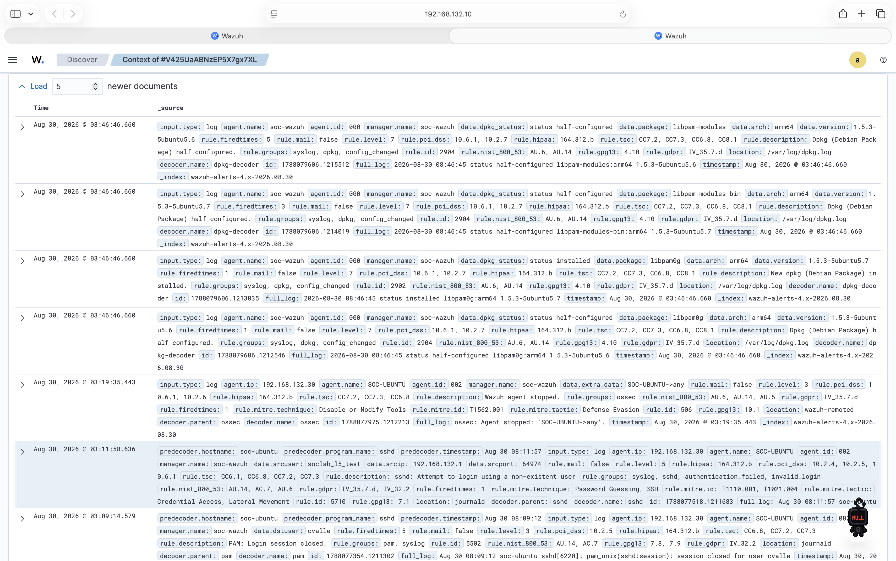
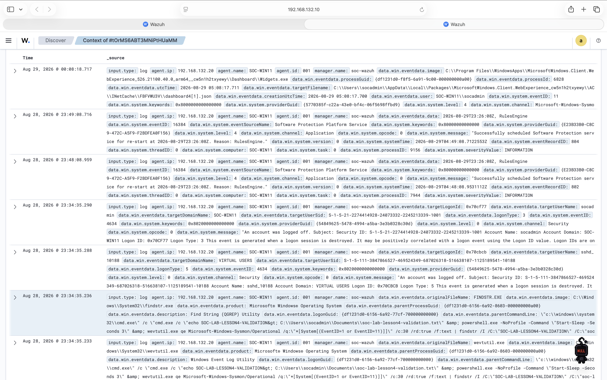

# Lesson 6 Alert Triage Worksheet

## Purpose

This worksheet provides a repeatable process for reviewing Wazuh alerts without
assuming that every alert represents malicious activity. It separates facts
contained in the telemetry from contextual knowledge supplied by the analyst,
records investigative gaps, and supports a defensible disposition and response.

## Triage Process

1. **Identify the alert.** Record the detection, severity, endpoint, source,
   account, activity, and time.
2. **Validate the evidence.** Confirm that the underlying event supports the
   rule description and note which details are directly observed.
3. **Establish context.** Determine whether the activity was authorized,
   expected, or associated with a known test or administrative action.
4. **Assess scope.** Review surrounding events for repetition, successful
   follow-on activity, additional endpoints, or related accounts.
5. **Assign a disposition.** Classify the alert using the definitions below.
6. **Select a response.** Document, monitor, escalate, contain, or remediate in
   proportion to the validated risk.

## Disposition Guide

| Disposition | Meaning |
|---|---|
| Malicious true positive | The detection accurately identified unauthorized or harmful activity. |
| Benign true positive | The detected activity genuinely occurred but was authorized or otherwise harmless in context. |
| False positive | The rule fired, but the underlying activity does not match the behavior the detection claims to identify. |
| Inconclusive | Available evidence is insufficient to support a reliable classification. |

A true positive is not automatically malicious. It means the rule correctly
described activity that actually occurred; context determines whether that
activity was benign or malicious.

## Reusable Case Template

### Case identification

| Field | Entry |
|---|---|
| Case title | |
| Analyst | |
| Investigation date | |
| Alert timestamp and timezone | |
| Data source | |
| Detection or rule | |
| Severity | |
| Endpoint and agent ID | |

### Observed evidence

Record only details directly supported by the alert, raw event, or another
identified artifact.

- Activity:
- Source:
- Target:
- User or account:
- Result:
- Frequency:
- Supporting artifacts:

### Context supplied by the analyst

- Was the activity expected or authorized?
- Is the source system or user known?
- Was a change, test, or administrative task in progress?
- Which source establishes this context?

### Scope and corroboration

- Relevant events before the alert:
- Relevant events after the alert:
- Successful follow-on activity:
- Other affected accounts or endpoints:
- Evidence gaps or limitations:

### Assessment and response

| Field | Entry |
|---|---|
| Disposition | |
| Confidence | |
| Rationale | |
| Response | |
| Escalation or containment | |
| Follow-up | |

---

## Worked Case 1: Ubuntu Invalid-User SSH Attempt

### Case identification

| Field | Observed value |
|---|---|
| Case title | Controlled invalid-user SSH attempt |
| Analyst | Lab owner |
| Investigation date | 2026-08-30 |
| Alert timestamp | 2026-08-30 03:11:58.636, dashboard time display |
| Data source | Ubuntu `journald` / `sshd`, collected by Wazuh |
| Detection | Wazuh rule `5710`: `sshd: Attempt to login using a non-existent user` |
| Severity | Wazuh level `5` |
| Endpoint | `SOC-UBUNTU`, agent `002`, `192.168.132.30` |

### Observed evidence

The Wazuh alert directly established the following facts:

- `sshd` received an authentication attempt for nonexistent user
  `soclab_l5_test`.
- The source address was `192.168.132.1`, the VMware host address on the
  private network, using source port `64974`.
- The target event was collected from `SOC-UBUNTU` (`002`) through
  `journald`.
- The alert matched rule `5710` once and was grouped under `syslog`, `sshd`,
  `authentication_failed`, and `invalid_login`.
- The attempt did not authenticate because the supplied username did not
  exist.

Primary preserved evidence:

- [`lesson-05-wazuh-linux-ssh-validation.png`](../screenshots/lesson-05-wazuh-linux-ssh-validation.png)
- [`linux-endpoint-deployment.md`](../docs/linux-endpoint-deployment.md)
- [`validate-linux-ssh-telemetry.sh`](../tests/validate-linux-ssh-telemetry.sh)

### Context supplied by the analyst

The lab owner intentionally generated one connection attempt from the Mac
using a unique test username and with password and public-key authentication
disabled. This authorization and intent are operator context; they are not
facts that the raw alert could determine on its own.

The source address is consistent with the documented VMware host-only network,
and the username matches the marker defined by the Lesson 5 validation
procedure.

### Scope and corroboration

The Wazuh surrounding-document view was reviewed around the alert:

- A preceding event at `03:09:14.579` recorded a session closing for legitimate
  user `cvalle`; it was not a successful login for `soclab_l5_test`.
- No successful authentication or follow-on activity for `soclab_l5_test` was
  visible in the reviewed context.
- A later agent-stopped event for `SOC-UBUNTU` was consistent with the lab VM
  being powered off or restarted and was not evidence of account compromise.
- Later `dpkg` alerts belonged to agent `000` (`soc-wazuh`) and were unrelated
  package-management activity on the manager.

The screenshot is supporting correlation evidence rather than a duplicate of
the primary alert image. It preserves the event context used to distinguish
the target authentication failure from unrelated endpoint and manager events.

The review was limited to the Wazuh events visible in the selected context and
the documented lab procedure. It did not constitute a forensic review of every
host artifact or all historical data.

### Assessment and response

| Field | Finding |
|---|---|
| Disposition | **Benign true positive** |
| Confidence | High |
| Rationale | The rule accurately detected a real invalid-user SSH attempt, but the attempt was an authorized, single-use validation from a known lab source with no observed successful authentication or suspicious follow-on behavior. |
| Response | Document the test and close the alert. Preserve the evidence for the portfolio. |
| Escalation or containment | None required. Do not block the Mac or isolate the endpoint for this authorized event. |
| Follow-up | Retain the case for comparison with Windows process telemetry and use the same workflow for future authentication alerts. |

## Case 1 Conclusion

Rule `5710` behaved as designed. The alert is useful security telemetry, but
the alert alone does not establish malicious intent. Correlation with the
documented lab test, known source, unique username, and absence of successful
follow-on authentication supports closure as a benign true positive.

---

## Worked Case 2: Windows Validation Process Activity

### Case identification

| Field | Observed value |
|---|---|
| Case title | Controlled Windows command and Sysmon validation |
| Analyst | Lab owner |
| Investigation date | 2026-08-30 |
| Alert timestamp | 2026-08-28 23:34:35.236, dashboard time display |
| Data source | Microsoft-Windows-Sysmon/Operational, collected by Wazuh |
| Detection | `Suspicious Windows cmd shell execution` |
| Severity | Not retained in the available evidence; no value inferred |
| Endpoint | `SOC-WIN11`, agent `001`, `192.168.132.20` |

### Observed evidence

The retained Wazuh event and surrounding-document view established these
facts:

- `findstr.exe` executed from `C:\Windows\System32\findstr.exe` under account
  `SOC-WIN11\socadmin`.
- The parent was `cmd.exe`, and the parent command line included the unique
  marker `SOC-LAB-LESSON4-VALIDATION` and marker path
  `C:\Users\socadmin\Documents\soc-lab-lesson4-validation.txt`.
- The command line queried the Sysmon Operational channel for Event IDs 1 and
  11 and searched the returned text for the unique marker.
- `wevtutil.exe` ran three milliseconds before `findstr.exe` with the same
  parent process GUID and the same validation command line. This is consistent
  with the event-query pipeline represented in the command.

Primary and supporting evidence:

- [`lesson-04-wazuh-sysmon-event-validation.png`](../screenshots/lesson-04-wazuh-sysmon-event-validation.png)
- [`lesson-06-windows-alert-surrounding-events.png`](../screenshots/lesson-06-windows-alert-surrounding-events.png)
- [`windows-endpoint-deployment.md`](../docs/windows-endpoint-deployment.md)
- [`validate-sysmon-telemetry.ps1`](../tests/validate-sysmon-telemetry.ps1)

### Context supplied by the analyst

The lab owner intentionally executed the repository's benign validation
procedure. That procedure creates a marker file, invokes `findstr.exe`, and
queries local Sysmon events to verify collection. The unique marker, path, and
process sequence in the Wazuh event match that documented procedure.

This authorization and test intent are contextual facts supplied by the
operator. Sysmon can establish which processes ran and with which arguments,
but it cannot independently determine whether the activity was approved.

### Scope and corroboration

The Wazuh surrounding-document view was reviewed around the highlighted
`findstr.exe` event:

- The immediately adjacent `wevtutil.exe` process shared the expected parent
  and validation command line.
- Account-logoff events for `socadmin` and an OpenSSH virtual user occurred at
  the same second, consistent with the remote administrative session ending.
- Later Software Protection Platform events were routine informational
  application events.
- A later Widgets cache-file event was unrelated background activity.
- No persistence change, suspicious network connection, unexpected child
  process, or additional affected endpoint was visible in the reviewed
  context.

The review was limited to retained Wazuh evidence, the displayed surrounding
documents, and the version-controlled validation procedure. The screenshot
does not preserve the alert's numerical Wazuh rule ID or level, so neither is
inferred in this report.

### Assessment and response

| Field | Finding |
|---|---|
| Disposition | **Benign true positive** |
| Confidence | High |
| Rationale | Wazuh and Sysmon accurately recorded the command-shell process sequence, but its marker, file path, process relationships, source account, and timing match an authorized validation procedure. No suspicious follow-on activity was visible. |
| Response | Document the test and close the alert. Preserve the process and context evidence for the portfolio. |
| Escalation or containment | None required. Do not isolate `SOC-WIN11` or disable the administrative account for this authorized activity. |
| Follow-up | If this activity were unplanned, validate the executable signatures and hashes, identify the initiating user and remote session, expand the time window, and hunt for network, persistence, or payload activity before closure. |

## Cross-Case Lessons

The Linux and Windows cases demonstrate the same analytical principle using
different telemetry:

- The Linux case required interpreting an authentication failure and checking
  for a later successful login.
- The Windows case required reconstructing parent-child process activity and
  checking for suspicious follow-on behavior.
- Both detections accurately described real activity.
- Neither alert could determine authorization or intent without external
  context from the analyst.
- Both were closed as benign true positives only after the evidence matched a
  documented test and the surrounding activity did not contradict that
  explanation.
